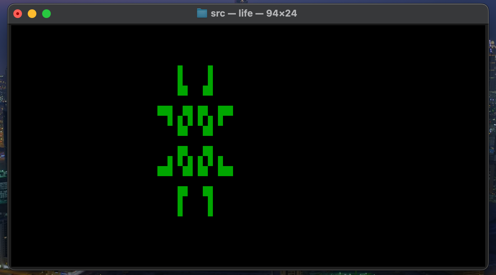

# Conway's Game of Life Simulation

## Requirements

- `gcc` compiler.
- `ncurses` library (for the terminal interface).
- OS: Darwin (macOS).

## Compilation
`gcc -Wall -Wextra -Werror -o life game_of_life.c -lncurses`

## Execution
`./life < Patterns/*.txt`

## Controls

◼ `a` — Increase speed 
◼ `z` — Decrease speed  
◼ `q` — Quit
