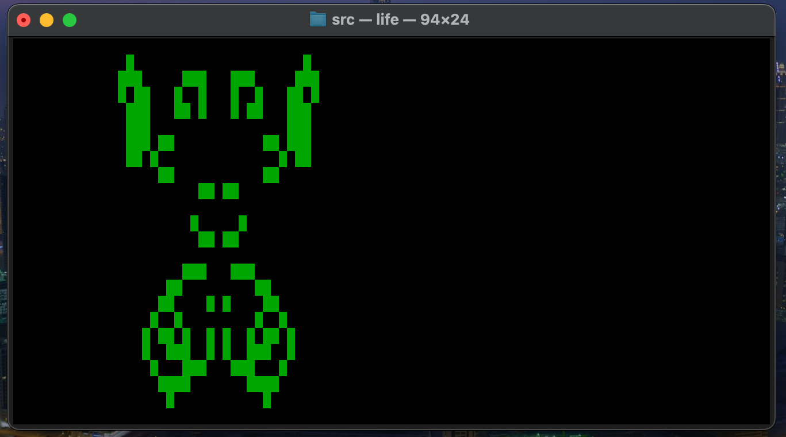

# Conway's Game of Life Simulation





## Requirements

- `gcc` compiler.
- `ncurses` library (for the terminal interface).
- OS: Darwin (macOS).


## Compilation
```bash
gcc -Wall -Wextra -Werror -o life game_of_life.c -lncurses


## Execution
```bash
./life < Patterns/*.txt


## Controls

◼ `a` — Increase speed 
◼ `z` — Decrease speed  
◼ `q` — Quit
